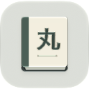

# MaruReader

MaruReader is a free, open source dictionary and reading application for
learning Japanese, which runs on iOS and iPadOS. You can use MaruReader to look
up unfamiliar words across multiple dictionaries while reading eBooks, manga,
and websites, or even from photos and screenshots. When you want to commit a new
term to memory, instantly create an Anki note with rich formatting and full
context.

[Website](https://marureader.org)

## Features

### Dictionary System

- **Deinflection** Inflected forms are automatically converted to dictionary
  form to make searching more convenient. Just enter text as you found it.
- **Sentence Furigana** To aid with reading sentences, the dictionary displays
  auto-generated readings. While this isn't 100% accurate, it can he a helpful
  reference.
- **Yomitan Dictionary Format Support**
  - MaruReader uses the same dictionary format as
    [Yomitan](https://yomitan.wiki/). Term, frequency, and pitch accent
    dictionaries are supported.
  - Add as many custom dictionaries as you like, search is fast even with many
    large dictionaries.
  - Learn more in the [Dictionary Guide](doc/Dictionaries.md)
- **Grammar Dictionaries** Understand how words are conjugated with links to
  relevant grammar lessons in results. See
  [the schema](doc/grammar-dictionary-v1.schema.json) if you'd like to make your
  own.
- **Search Within Definitions** Tap on words in dictionary definitions to search
  in a compact popup, and tap in the popup to open those results in the full
  dictionary search page. This is a must-have feature for learners using
  monolingual (Japanese-Japanese) dictionaries.

### Manga Reader

- **On-device text recognition (OCR)** MaruReader uses your device's built-in
  text recognition capabilities to read text on manga pages with no need for
  pre-processing or specialized file formats, just add any ZIP/CBZ and start
  reading. Tap on the text you want to look up, and it will open alongside the
  page. Auto-generated furigana can also be displayed on the lookup page.
- **Smart Metadata** On devices with Apple Intelligence supported and enabled,
  the title and author displayed in the manga library can be extracted from
  filenames with no specific naming scheme or special metadata file needed.
- **Mokuro support** If you'd rather prepare OCR ahead of time, you can attach a
  [mokuro](https://github.com/kha-white/mokuro) file to a manga and MaruReader
  will use its text instead. A `.mokuro` file packaged inside the CBZ is
  attached automatically on import. Learn more in the
  [Mokuro Guide](doc/Mokuro.md)

### Book Reader

- **Optimized for Japanese eBooks** MaruReader displays books with vertical text
  (tategaki) and fonts designed for Japanese text.
- **Compact dictionary popup search** In the book reader, tapping on text opens
  a compact popup for the specific word you tapped, keeping you closer to the
  book.

### Web Browser

- **Text recognition for web-based content** You can use MaruReader even without
  offline books and manga. Open what you want to read online in the built-in web
  browser. Activate OCR mode and tap on text to look it up using the same text
  recognition system used by the manga reader, or search text in the dictionary
  by highlighting it.
- **Content blocker** The web browser has a content blocker with general and
  Japan-specific filters, so you can read with fewer distracting ads and
  trackers.

### Photo Scanner

- **Text Recognition for Everything Else** Whether you need to look up a word
  from a sign in Japan, a screenshot of an app or game, or anything else, the
  photo scanner has your back. Snap or import a photo from the Scan tab, or
  share from another app.

### Anki Integration

- **AnkiMobile Integration** MaruReader can add notes to the AnkiMobile app by
  tapping the "+" button in any dictionary lookup context. Includes built-in
  configuration for Lapis, and the ability to configure your own note fields for
  other note types.
- **Anki-Connect Integration** Advanced users also have Anki-Connect as an
  option. This has some benefits including customizable duplicate note
  detection.
- Learn more in the [Anki Guide](doc/Anki.md)

## Questions?

See the [FAQ](doc/FAQ.md), or open a thread in the Discussions tab.

## Acknowledgements

The MaruReader dictionary system is based on [Yomitan](https://yomitan.wiki/).
The deconjugation rules are based on [Jiten](https://github.com/Sirush/Jiten).
Third-party libraries are listed in the About section of the app.

If you download MaruReader from the App Store, you'll also get a package of the
best freely licensed dictionaries and audio available, listed below:

- [Jitendex Japanese-English Dictionary](https://jitendex.org) by Stephen Kraus
- [BCCWJ Frequency Dictionary](https://github.com/Kuuuube/yomitan-dictionaries?tab=readme-ov-file#bccwj-suw-luw-combined)
  by National Institute for Japanese Language and Linguistics
- [Wadoku Pitch Accent Dictionary](https://github.com/classicsc/wadoku-pitch-dictionary-for-yomitan)
  by Wadoku.de
- [Kanji alive Audio](https://github.com/classicsc/kanji-alive-indexer) by
  Harumi Hibino Lory and Arno Bosse
- [Yokubi Grammar Guide](https://yoku.bi) by Yokubi Authors

The manga shown in the screenshots is used under the terms listed on
[the author's website](https://densho810.com/free/).

**Title**: Give My Regards to Black Jack

**Author**: SHUHO SATO
